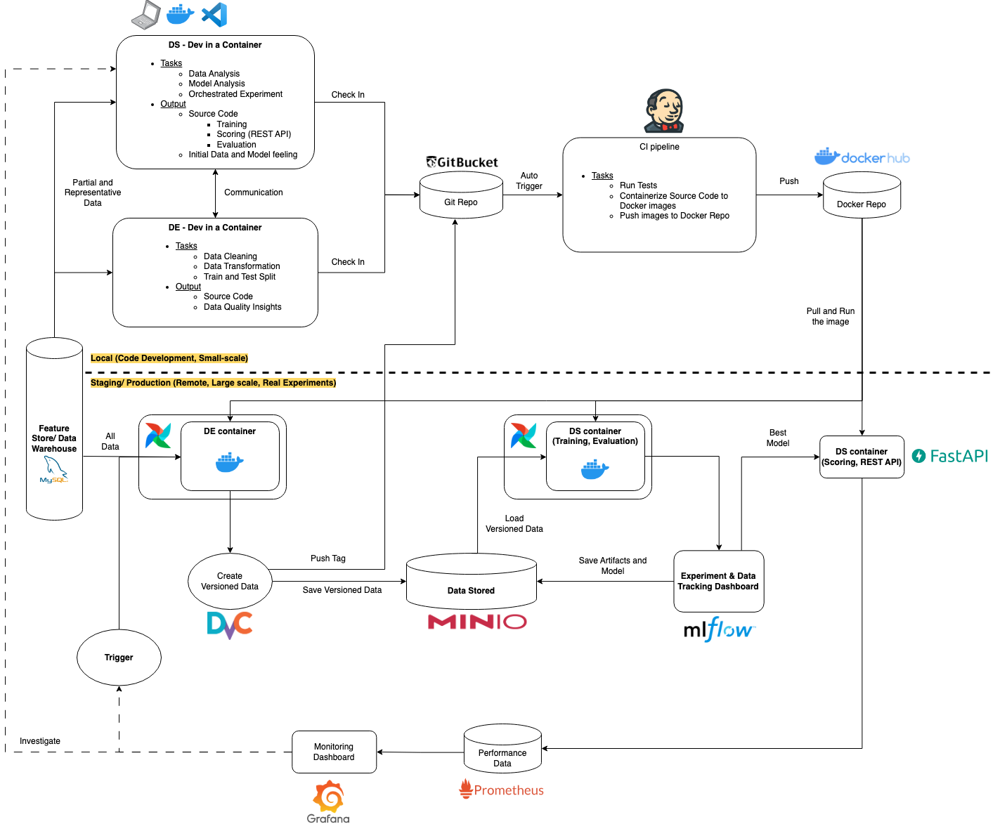

# Goal and Architecture
This is a poc repo about my take on creating a MLOps system using open source tools. 

The thing I focus here is how to make all the services connected together instead of tool itself. Most of the open source tools that I use here has their alternatives, I just selected the ones that I can easily test and spin up in my local machine. 

For example, 
* Git platform and DevOps
    * Gitbucket (alternative for Github, Bitbucket, etc)
    * Jenkins (alternative for Gitlab, Azure DevOps, etc)
* Docker Image Repository
    * DockerHub (alternative for Nexus, AWS ECR, etc)
        * I was able to spin up the `nexus` container in local, but had issues on `docker login` to the Nexus local repo. Further configurations on the "insecure registry" (https://docs.docker.com/registry/insecure/) might solve the issue, but it is overkilled for this poc. I decided to use DockerHub instead. 
* Database
    * MySQL (alternatives for PostgreSQL, Microsoft SQL Server, etc)
* Time Series Database
    * Prometheus (alternative for InfuxDB, Graphite, etc)
* Object Storage
    * MinIO (alternatives for AWS S3, Azure Blob Storage,etc)
* Scheduling Tools
    * Airflow (alternatives for Prefect, AWS Step Function, etc)
* Monitoring Tools
    * Grafana (alternatives for Kibana, PowerBI, etc)

<br/>

This is the architecture diagram. Every services are run in Docker containers, so we can host any of the service on the remote server easily if we want. 
<p align="center">

</p>

# Services Setup
1. Create a network called `mynetwork` to connect all the services.
    ```sh
    docker network create mynetwork
    ```

2. Run the storage related containers (`mysq`, `phpmyadmin`, `minio`).
    ```sh
    docker compose -f docker-compose-storage.yml -p storage up -d
    ```
    * Log in `phpmyadmin`.
        * `http://localhost:8081`
        * username:password is `root:root` or `admin:admin`
    * Log in `minio`
        * `http://localhost:9001`
        * username:password is `myaccesskey:mysecretkey`

3. Run the `gitbucket` and `jenkins` containers.
    ```sh
    docker compose -f docker-compose-jenkins.yml -p devops up -d --build
    ```
    * Log in `gitbucket`.
        * `http://localhost:8082`
        * username:password is `root:root`
    * Start `jenkins`.
        * `http://localhost:8080`
        * Create an admin user with username:password as `admin:admin`.
        * Install the [Gitbucket](https://plugins.jenkins.io/gitbucket/) plugin.
        * Add your Dockerhub username and password as a jenkins global credential with ID as `dockerhub`.
        * Refer [How to Build and Push Docker Images to Docker Hub using Jenkins Pipeline](https://sweetcode.io/how-to-build-and-push-docker-images-to-docker-hub-using-jenkins-pipeline/).

4. Run `airflow` related containers.
    ```sh 
    # Set your Dockerhub credentials as environment variables
    export DOCKERHUB_USR=<your-dockerhub-username>
    export DOCKERHUB_PWD=<your-dockerhub-password>
    
    docker compose -f docker-compose-airflow.yml -p airflow up -d 
    ```
    * Log in `airflow`
        * `http://airflow:9090`
        * username:password is `admin:admin`

5. Create a repo called `myairflow_dags`, in the `gitbucket` container through the ui (`http://localhost:8082`) and check in all the files in `~/DevOps_In_DS/gitbucket_repos/myairflow_dags` to the repo.
    * Run the commands with `root:root` as username:password.
        ```sh
        cd ./gitbucket_repos/myairflow_dags
        git init
        git add .
        git commit -m "first commit"
        git remote add origin http://localhost:8082/git/root/myairflow_dags.git
        git push -u origin main
        ```
    * Manually type in the `gitbucket` crendentials `root:root` on the terminal prompt

6. Create a repo called `de_datapreprocessing`, in the `gitbucket` container through the ui (`http://localhost:8082`) and check in all the files in `~/DevOps_In_DS/gitbucket_repos/de_datapreprocessing` to the repo.
    * Run the commands with `root:root` as username:password.
        ```sh
        cd ./gitbucket_repos/de_datapreprocessing
        git init
        git add .
        git commit -m "first commit"
        git remote add origin http://localhost:8082/git/root/de_datapreprocessing.git
        git push -u origin main
        ```
    * Steps to initiate a DVC project in the git project (it is already done in this poc project).  
        * ```sh
          dvc init
          ```
        * Update the `~/.dvc/config`
            ```sh
            ['remote "main"']
                url = s3://de-datapreprocessing/dvc
                endpointurl = http://minio:9001
            ['remote "local"']
                url = s3://de-datapreprocessing-local/dvc
                endpointurl = http://minio:9001
            ```

5. Create a multibranch pipeline called `de_datapreprocessing_pipeline` in the `jenkins` container through the ui (`http://localhost:8080`) and have it connect to the repo, `de_datapreprocessing`.
    * The repo URL is `http://gitbucket:8080/git/root/de_datapreprocessing.git`.

# Trigger (have services connected together)
1. Build `de_datapreprocessing` docker image and push to DockerHub using the Jenkins pipline, `de_datapreprocessing_pipeline`.
    * Manually trigger the pipeline by hitting the `Build Now`. <mark><--- Ideally, it should be run automatically after code checked in.</mark>
    * Check out the personal DockerHub repo to see if the image are pushed with the `latest` tag.

2. Run `de_preprocessing` dag in `airflow`. 
    * Check out the tag in `de_preprocessing` repo in `gitbucket` with tag name as this format `CV_<last_commit_message>_DV_<time_versioned_data_generated>`.
    * Check out the data in the `de-datapreprocessing` bucket in `minio`.
    
# Clean up
* Remove all the containers.
    ```sh
    docker compose -f docker-compose-storage.yml -p storage down
    docker compose -f docker-compose-jenkins.yml -p devops down
    docker compose -f docker-compose-airflow.yml -p airflow down

    docker network prune -f
    docker volume prune -f
    ```
* Remove the local git repo (`myairflow_dags`, `de_datapreprocessing`).
    ```sh
    rm -rf ./gitbucket_repos/myairflow_dags/.git
    rm -rf ./gitbucket_repos/de_datapreprocessing/.git
    ```

# Future works
* Figure out how to automatically run the pipeline in `jenkins` by checking in the code to the repo in `gitbucket` instead of manually hitting `Build Now` on the ui.
    * For some reasons, the webhook to connect `jenkins` and `gitbucket` was not working as expected this time.  
        * [How to trigger auto build in Jenkins via Gitbucket's webhook?](https://stackoverflow.com/questions/49574298/how-to-trigger-auto-build-in-jenkins-via-gitbuckets-webhook)
        * [How to auto build a job in jenkins if there is any change in code on Github repository](https://www.edureka.co/community/49753/auto-build-job-jenkins-there-change-code-github-repository)
* For simplicity, the credentials in the poc project are all hard coded in the `~/.env` file. The best practice is to take advantage of some secret management tools like AWS Secret Manager, HashiCorp Vault, etc. 


# References
* [MLOps: Continuous delivery and automation pipelines in machine learning](https://cloud.google.com/architecture/mlops-continuous-delivery-and-automation-pipelines-in-machine-learning)
* [MLOps Principles](https://ml-ops.org/content/mlops-principles)
* [How to Build and Push Docker Images to Docker Hub using Jenkins Pipeline](https://sweetcode.io/how-to-build-and-push-docker-images-to-docker-hub-using-jenkins-pipeline/) 

# TODO
- [] add mlflow services for quick visualization interface for versioned data and later model experiment tracking
- [] log generated versioned data description artifacts to mlflow
- [] be able to run historical data preprocessing versioned code, in `run.sh` checked out a specific code commit. The code commit can be passed in as a dag parameter and then env var for docker container 

- [] create ds_mlmodeling image and log everything to mlflow
- [] create a restapi container to pull model from mlflow artifacts datasource with experiment id as model version and pass in to container as env var
- [] log api usage and model performance in Prometheus and Grafana 